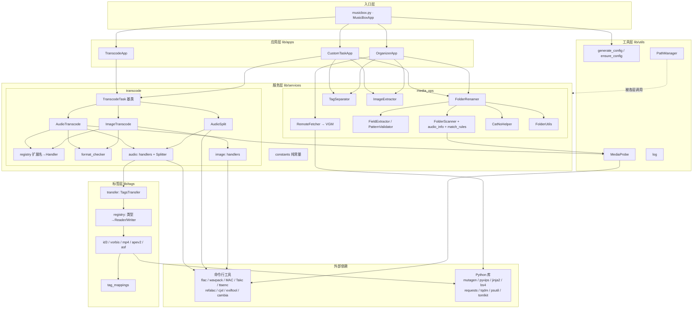
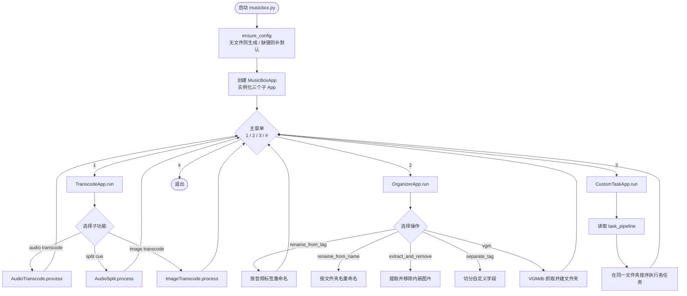
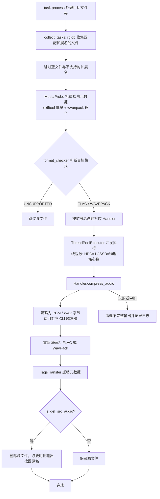
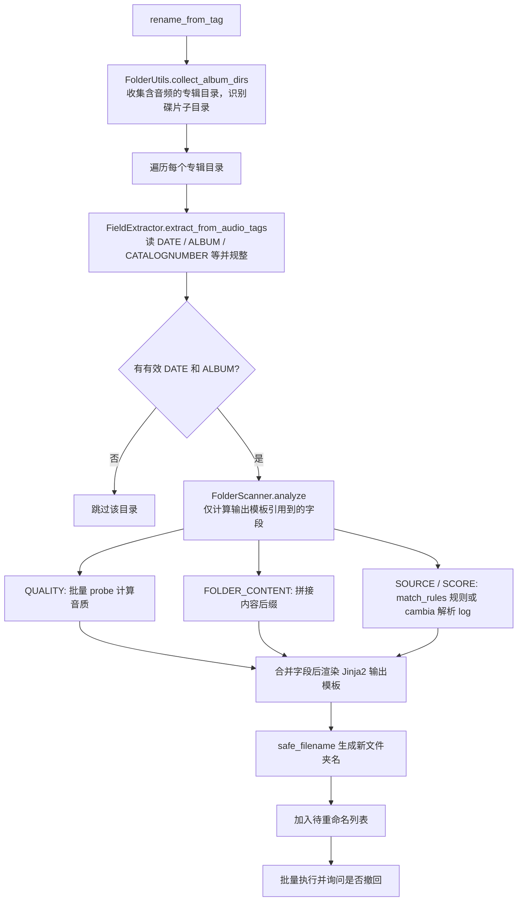
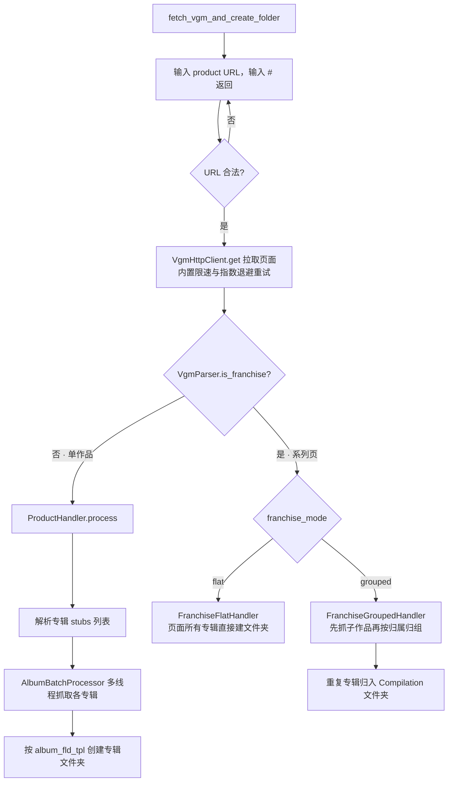
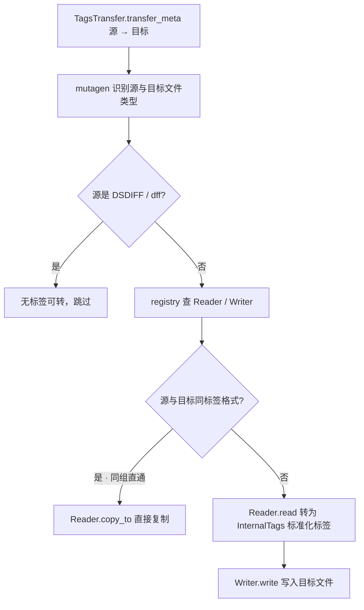

# MusicBox 项目架构

本文档基于当前代码生成，描述 MusicBox 重构后的分层结构与主要运行流程。所有流程图使用 [Mermaid](https://mermaid.js.org/)，可直接在 GitHub / 支持 Mermaid 的 Markdown 阅读器中渲染。

## 设计概览

整体采用**分层 + 注册表**的结构，依赖方向自上而下：

```
入口层  →  应用层  →  服务层  →  标签层 / 工具层  →  外部命令行工具 + Python 库
```

- 转码与整理通过 `tags.registry`（类型 → Reader/Writer 映射）与 `tags.transfer` 复用一套统一的「内部标签」抽象。
- 转码任务、音频/图片处理器、标签 Reader/Writer 都通过**注册表（扩展名 / 类型 → 类）**做分发，新增格式只需登记映射，不改调度逻辑。

## 目录结构

```
musicbox.py                     入口，组装 MusicBoxApp 三个子 App
config.toml                     运行配置（首次运行自动生成）
lib/
├── apps/                       应用层：三个交互式子 App
│   ├── transcode_app.py        转码菜单
│   ├── organizer_app.py        媒体整理菜单
│   └── custom_task_app.py      自定义任务流
├── services/
│   ├── constants/              纯常量（格式、CLI 指令、扫描/重命名/VGM 等）
│   ├── transcode/              转码服务
│   │   ├── transcode_task.py   任务基类（线程策略 / 批量 probe / 并发）
│   │   ├── audio_transcode.py / audio_split.py / image_transcode.py
│   │   ├── registry.py         扩展名 → Handler
│   │   ├── format_checker.py   是否转换 + 目标格式判定
│   │   ├── audio/              各音频格式 Handler + Splitter
│   │   └── image/              各图片格式 Handler
│   └── media_ops/              媒体整理服务
│       ├── folder_naming/      文件夹重命名（FolderRenamer / FieldExtractor / 校验）
│       │   └── folder_scanner/ 文件夹扫描（音质 / 来源 / 内容后缀 / 匹配规则）
│       ├── remote_fetcher/     远程抓取
│       │   └── metadb/vgm/     VGMdb 抓取（fetcher / handler / parser / data_type）
│       ├── tag_separator.py    字段切分
│       ├── image_extractor.py  内嵌图片提取 / 移除
│       ├── catno_helper.py     光盘编号折叠 / 展开
│       └── folder_utils.py     专辑目录收集
├── tags/                       标签抽象层
│   ├── base.py                 MetaReader / MetaWriter / InternalTags
│   ├── registry.py             mutagen 类型 → Reader/Writer
│   ├── transfer.py             TagsTransfer 跨格式元数据迁移
│   ├── tag_mappings.py         各格式字段映射表
│   └── id3.py / vorbis.py / mp4.py / apev2.py / asf.py
└── utils/                      工具层
    ├── generate_config.py      生成 / 补全配置
    ├── log.py                  日志（控制台 + 滚动文件）
    ├── media_probe.py          MediaProbe（exiftool / wvunpack 批量探测）
    ├── path_manager.py         路径管理（扩展长路径 / 防重名 / 安全文件名）
    └── clear_screen.py
```

> **重构遗留提示**：`lib/services/media_ops/` 下的 `folder_renamer/` 与 `folder_scanner/` 两个目录是重构前的旧结构，已不被任何 `__init__` 或外部模块导入（仅自身互相引用）。当前实际生效的是 `folder_naming/`（内含 `folder_scanner/`）。这两个旧目录可以安全删除。

---

## 1. 分层架构图



---

## 2. 启动与主菜单流程



---

## 3. 转码流程（TranscodeTask 通用流水线，以音频为例）



> 图片转码（`ImageTranscode`）复用同一套基类流水线，差异在于：`format_checker` 判断的是「是否可转 JXL」，Handler 通过 `cjxl` 编码，元数据用 `exiftool` 迁移，且线程数恒为物理核心数（瓶颈在 CPU）。
> 分轨（`AudioSplit`）也走同一基类，但只收集「存在同名 cue 且可直接分轨」的整轨，最终调用 `Splitter.split_with_cue` 按帧切分。

---

## 4. 按音频标签重命名（rename_from_tag）流程



---

## 5. VGMdb 抓取流程



---

## 6. 标签迁移（TagsTransfer）流程

转码时源/目标文件常常是不同容器格式，元数据迁移统一收敛到 `TagsTransfer`：



`InternalTags` 是一套与具体容器无关的「字段名 → 值集合」表示。各格式的 Reader 负责把原生标签读成 `InternalTags`，Writer 负责写回，从而实现 ID3 / Vorbis / MP4 / APEv2 之间的跨格式迁移；同格式之间则走 `copy_to` 直通以避免无谓转换。
